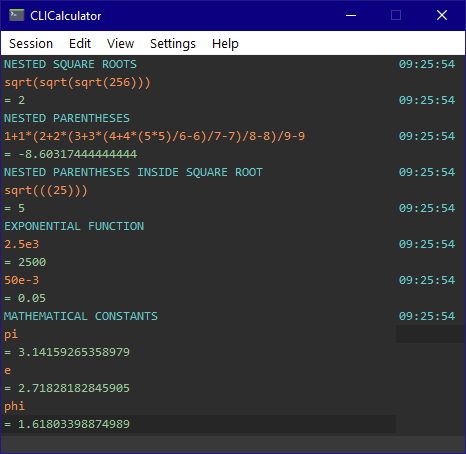
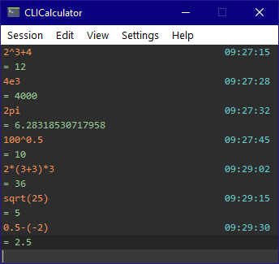

# CLI Calculator
##  Basic Command Line Interface scientific calculator using Qt Creator Framework

Features basic opperations such addition, subtraction, division, multiplication... but also exponentials and square roots, nest operations inside parentheses inside parentheses unlimitedly. It analyzes the string of characters and divides by priority levels to solve it in order, respecting the hierarchy of operations.

It also includes the typical mathematical constants (Pi, Phi, e...).
To see a short demo you can type ```test``` and to clear the history you can type ```clear```.
The taskbar is unfinished, except for the ```Edit``` and ```View``` tabs.

 


